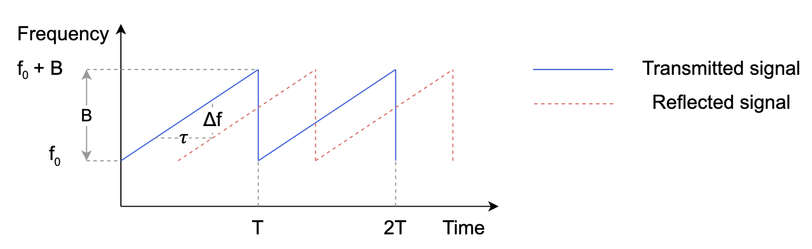

# Table of Contents
1. [Introduction](#introduction)
2. [Background](#background)
    1. [Measure distance using FMCW](#distance)
    2. [Measure heart rate using FMCW](#heartrate)
3. [Getting started](#started)

# Introduction 
SONAR (Sound Navigation and Ranging) is a technique leveraging the propagation of sound for navigation, distance measurement and object detection underwater.

With the rise of mobile devices, SONAR becomes increasingly available with only a pair of speaker-microphone (i.e. a transceiver). One noble application of SONAR in mobile devices is respiratory and heart rate measurement.

A simple setup can be:

- A person sitting or standing still
- A pair of speaker-microphone (can come from a smartphone or a smart speaker) placed in front of the person, at around his/her chest level

# Background 
## Measure distance using FMCW 
FMCW (Frequency Modulated Continuous Waves) are waves that are continuously modulated in frequency over a pre-defined time period. The sweep frequency within the time period is commonly referred to as a "chirp". The frequency by time is denoted as:
$$f = f_0 + \frac{B}{T}t$$
where $B$ is the bandwidth ($Hz$) and $T$ (second) is the sweep time. Therefore, by taking the derivative of the frequency, we have the representation of a single chirp:
$$x(t)=cos\bigl(2\pi(f_0t+\frac{Bt^2}{2T})\bigr)$$

The microphone will record two types of waves: one directly from the speaker (transmitted) and one is the reflection from the waves hitting the target (reflected). For example, the blue line in the figure below shows the transmitted and reflected chirps in the microphone.

Hence, the reflected chirp is denoted as:
$$ x'(t)=\alpha cos\bigl(2\pi(f_0(t-\tau)+\frac{B(t-\tau)^2}{2T})\bigr)$$
where $\tau$ is the round-trip time (the time it takes to travel from the transceiver to the target, and then from the target to travel back to the transceiver) and $\alpha$ refers to the signal amplitude attenuation.

With a static target, we have $\tau=\frac{2R}{c}$, where $c$ is the speed of sound $343 m/s$ and $R$ is the distance between the target and the transceiver.  To compute $R$, we multiply the transmitted signal $x(t)$ by the received signal $x'(t)$. The mixed signal $x_m(t)$ is then represented as:

$$
x_m(t) = x(t) \cdot x'(t) = \frac{\alpha}{2}\Bigl(cos\bigl(2\pi(f_0\tau - \frac{B(\tau^2 - 2t\tau)}{2T})\bigr) + \\ cos\bigl(2\pi(f_0(2t-\tau) +\frac{B(2t^2-2t\tau+\tau^2)}{2T})\bigr)\Bigr)
$$

The mixed signal consists of two terms. By taking the derivative of the phase by $t$, we have the frequency of the first term that is a constant, $\Delta f = \frac{B}{T}\tau=\frac{2BR}{Tc}$. This implies that **every range $R$ maps to a specific frequency $\Delta f$**. The second term is a function of $t$ with high frequency and can be removed by a low pass filter. In the end, after the multiplication and a low pass filter, we have:

$$
 x_m(t)=\frac{\alpha}{2} \cdot exp\bigl(j2\pi(f_0\tau - \frac{B(\tau^2 - 2t\tau)}{2T})\bigr)
$$

By transforming the frequency of $x_m(t)$, we have:

$$  R=\frac{cT}{2B}\Delta f  $$

## Measure heart rate using FMCW 
Given a typical bandwidth of $B=5 kHz$ ($f_0$ is usually18 kHz) in audio sensing, the resolution of $R$ is $\delta R \geq \frac{cT}{2B}\delta f = \frac{cT}{2B} \cdot \frac{1}{T} = \frac{343}{2\cdot5000}=3.43 cm$. This resolution is not enough to monitor heartbeat-induced chest displacement $\Delta d$, which is approximately 0.1 - 0.5 mm.

Literature has demonstrated that the minute chest displacement $\Delta d$ can cause the phase change in $x_{mf}(t)$ up to 18&deg;. Specifically, $x_{mf}(t)$ can be expressed as:

$$
x_{mf}(t) = \frac{\alpha}{2} \cdot exp\Bigl[j(2\pi f_0 \tau - \frac{\pi B \tau^2}{T} + \frac{2 \pi t \tau B}{T})\Bigr] \\ 
\approx \frac{\alpha}{2} \cdot exp\Bigl[j(2\pi f_0 \tau + \frac{2 \pi t \tau B}{T})\Bigr] \\ 
=\frac{\alpha}{2} \cdot exp\Bigl[j\Bigl(\frac{4\pi f_0}{c}r(t) +  2\pi \Delta f t\Bigr)\Bigr] \\ 
=\frac{\alpha}{2} \cdot exp\Bigl[j\Bigl(\frac{4\pi f_0}{c}\Delta d +  2\pi \Delta f t\Bigr)\Bigr]
$$

As such, if the chest displacement caused by heartbeat is 0.5mm, the phase change is calculated as:

$$
    \frac{4\pi f_0}{c}\Delta d = \frac{4\pi \cdot 18000 \cdot 0.0005}{343} = 0.105 \pi = 18.9 ^{\circ}
$$

This number is significant enough to see, while it is not if we look at distance $R$.

# Getting started 
1. To generate chirp file, run: `python gen_chirp.py`. A chirp with params in file `config.py` will be created.

2. Set up the measurement as explained in Introduction.

3. Go to `heart_rate_measurement.ipynb` to walk through extracting heart rates step by step.
